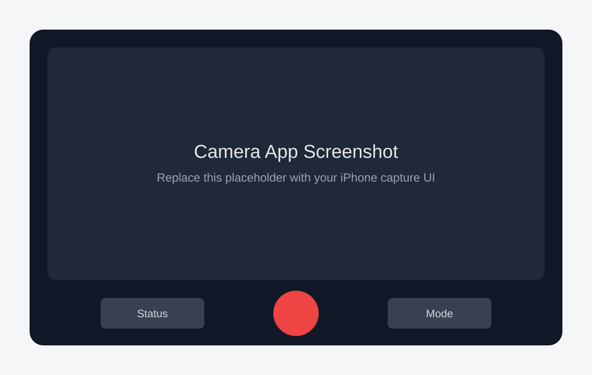
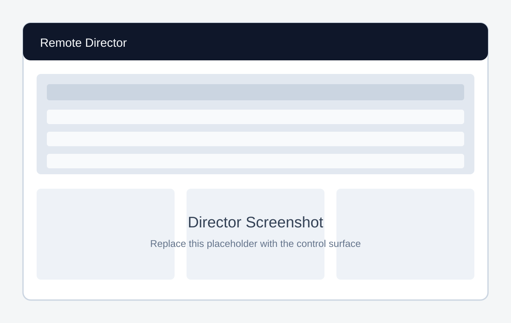

# SyncREC: A Synchronized Multi-iPhone Video Capture System for 3D/4D Reconstruction

SyncREC is a multi-iPhone video capture system developed by Stanford Vision and Learning Lab (SVL) for high-fidelity 3D/4D capture, pairing a foreground iOS camera app with a Python remote director for millisecond-level coordination*, remote control, preview checks, capture-parameter sync, and media ingest across a camera rig.

## Screenshots

| Camera App | Remote Director |
| --- | --- |
|  |  |
| Replace with a screenshot of the iPhone capture interface. | Replace with a screenshot of the Python director control surface. |

## What It Does

SyncREC turns a group of iPhones into coordinated capture nodes for volumetric, 3D/4D reconstruction, and multi-view video workflows. Each phone runs the camera app in the foreground while the director discovers connected devices, applies shared capture settings, schedules recording commands, monitors health, pulls footage, and keeps operators aware of which devices are ready.

The system is designed around practical rig operation: fast setup, clear device status, repeatable take naming, sidecar metadata, and selective or all-device controls for every important action. Its purpose is to make low-cost, high-fidelity reconstruction practical with commodity phones: refurbished iPhones can cost around $100 each while still providing 4K 60fps capture, making the rig far cheaper than many dedicated 3D/4D reconstruction or motion-capture setups. The project is intended as a first of its kind research-grade iPhone-based capture system.

* Director-only synchronization uses millisecond timestamps, but real network and device scheduling delays can still leave starts off by at most 5 frames at 30fps. For high-fidelity 4D reconstruction, pairing director coordination with an initial clap or movie slate enables post-capture clap-sync and can bring offsets within a frame at 60fps.

## Camera App

- Captures high-quality video on iPhone using AVFoundation, with presets for 720p, 1080p, and 4K at supported frame rates.
- Connects to the director over the local network and reports recording state, battery, storage, capture mode, timecode, transfer state, and camera-parameter status.
- Supports remote arm, prepare, scheduled start, scheduled stop, preview photo, capture-mode change, camera-parameter sync, video pull, and cleanup commands.
- Stores each take locally with a calibration JSON sidecar containing session metadata, capture settings, camera parameters, and AVFoundation calibration fields when the device exposes them.
- Includes rig-friendly power behavior: recording and active transfers keep the phone awake, Guided Access can keep a foregrounded rig phone ready, and the director can allow Auto-Lock after pulls.

## Remote Director

- Provides a desktop Python control surface for managing all connected camera phones from one place.
- Shows a live device table with connection, recording, armed, transfer, capture-mode, preview, battery, storage, and parameter-sync status.
- Applies capture modes to all or selected devices and remembers the last selected mode so the director clock starts at the matching FPS on launch.
- Schedules coordinated recording starts and stops with prepare/commit flows for repeatable multi-device takes.
- Captures preview photos from all or selected devices and can build a grid image for quick framing checks.
- Copies, dry-runs, syncs, locks, unlocks, and validates camera parameters across the rig.
- Pulls videos through a bounded transfer queue, supports per-device or all-device operations, and can optionally allow Auto-Lock after transfer completion.

## Typical Workflow

1. Start the Python director on the control computer.
2. Wake up the camera phones if they are off or sleeping.
3. Record from the director.
4. Pull videos to the computer.

## Technical Notes

- [Mobile app dev notes](docs/mobile-app-dev-notes.md)
- [Python director dev notes](docs/python-director-dev-notes.md)
- [Optional device setup guide](docs/device-setup-guide.md)

## Technology

- iOS app: Swift, SwiftUI, AVFoundation, URLSession WebSocket, local file sidecars.
- Director: Python, Tkinter, asyncio, WebSocket command routing, local HTTP upload ingest.
- Origin: adapted from Apple's AVCam sample and extended into a multi-device capture rig.
