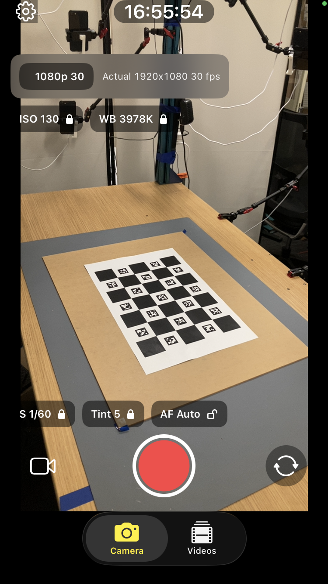
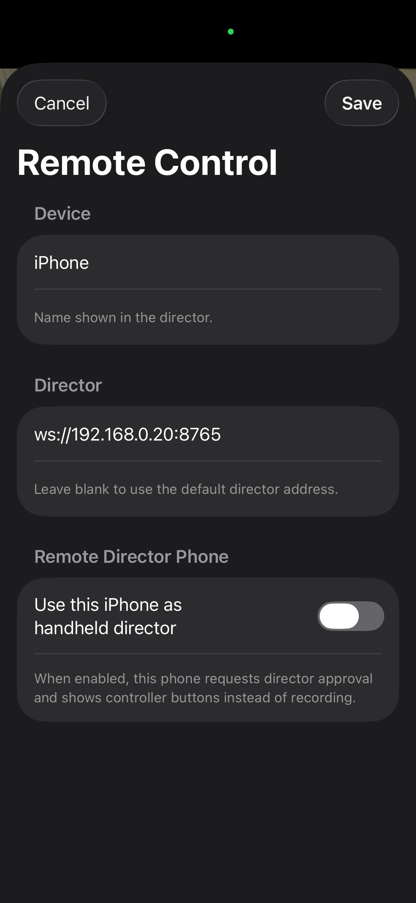
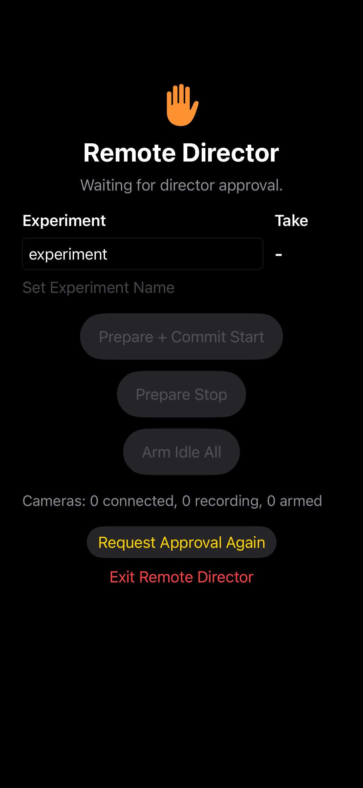
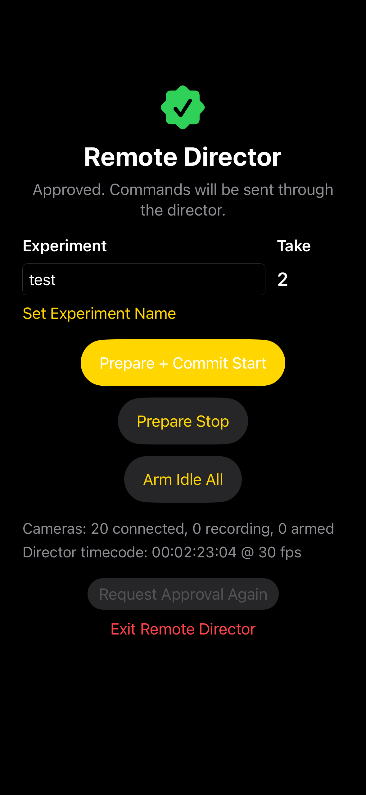
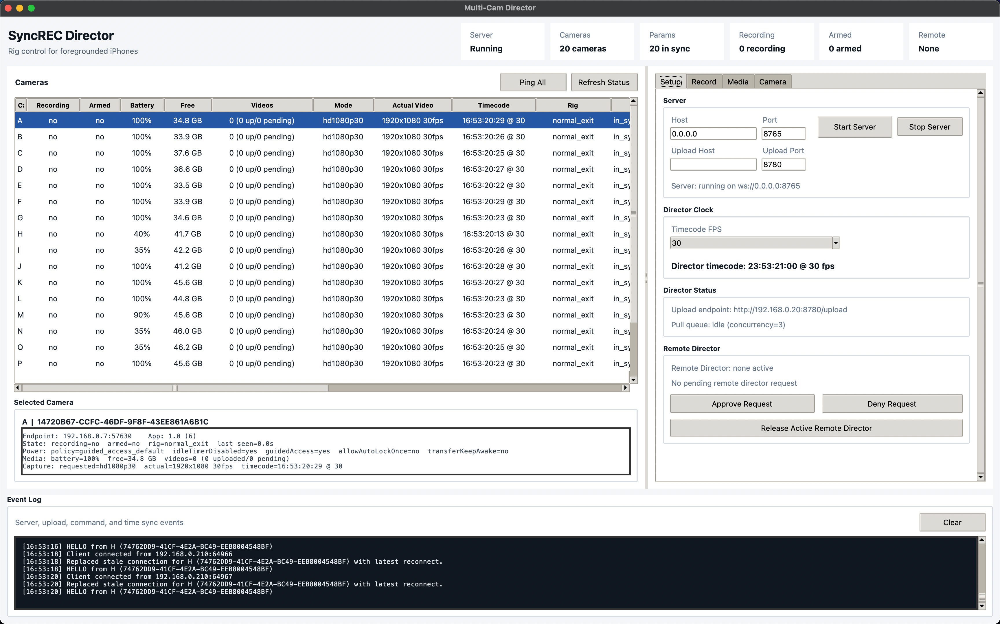
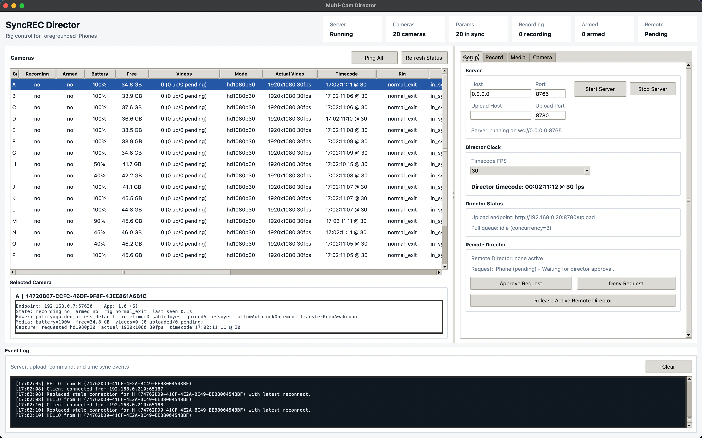
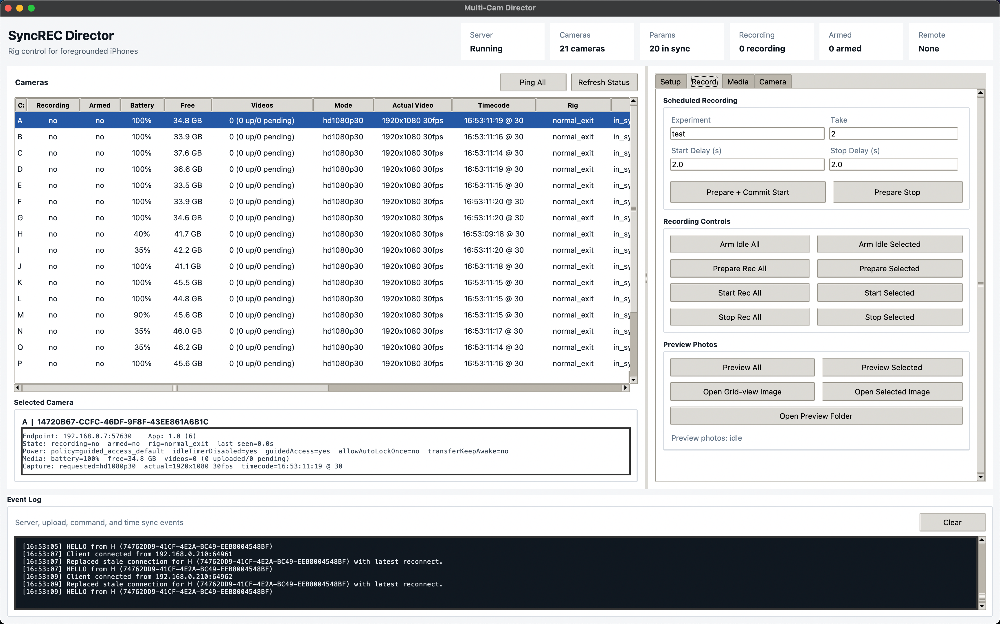
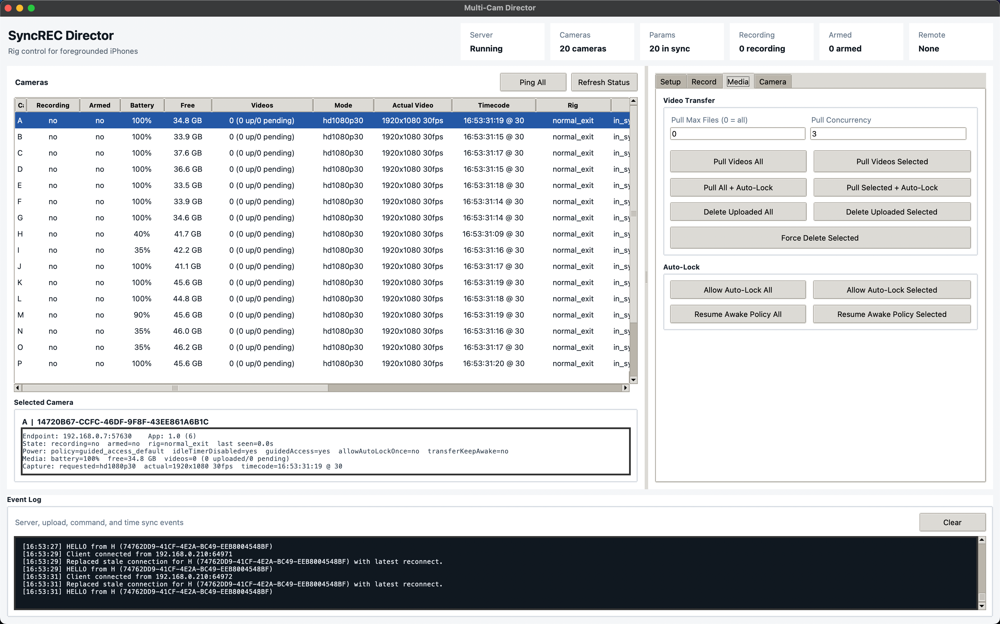
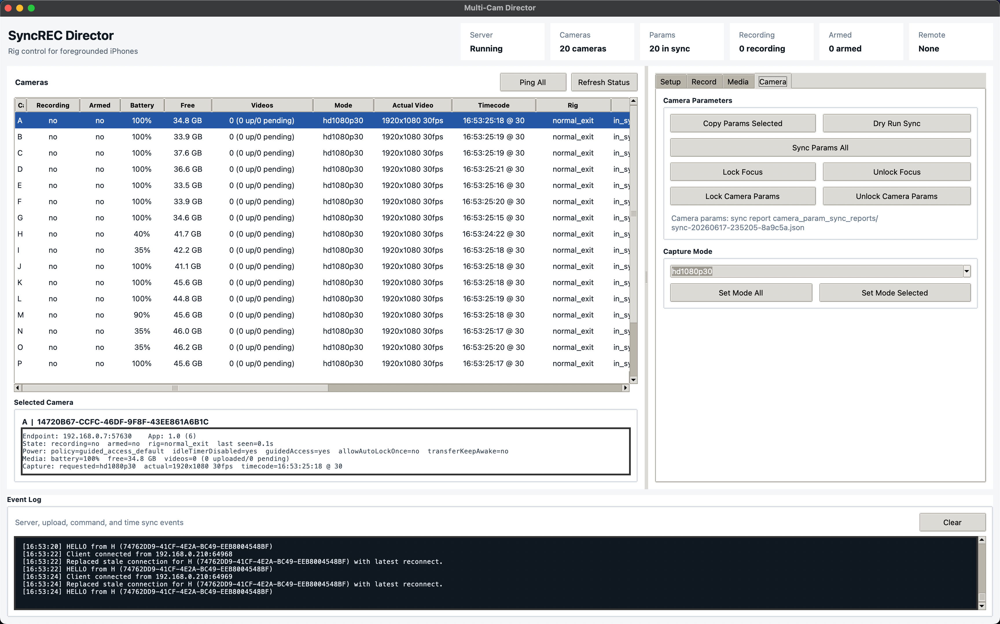

# In-App And Director Functionality Guide

This guide maps the main SyncREC iPhone and director screens to the capture-rig workflow. It is meant as an operator-facing tour rather than a code reference.

## iPhone Camera App

### Camera Tab

The Camera tab is the foreground capture surface used on each rig phone. It shows the live camera preview, current timecode, selected capture mode, actual resolved video format, and lockable camera parameters such as ISO, shutter, white balance, tint, and autofocus mode.

The record button can still be used locally, but rig operation normally sends recording commands from the director. The lower tab bar switches between the live camera surface and local videos.

### Remote Control Settings

The settings page names the device as it appears in the director and configures the director WebSocket URL. The optional handheld director mode turns an iPhone into a lightweight remote controller instead of a capture phone.

When handheld director mode is enabled, the phone requests approval from the desktop director before it can issue commands.

### Waiting For Director Approval

Before approval, the handheld director screen is read-only. It can set an experiment name locally and request approval again, but recording controls remain disabled until the desktop director accepts the request.

### Approved Handheld Director

After approval, the handheld director can start common rig operations without the desktop UI in hand. It can set the experiment name, send a prepare-plus-commit start, prepare a stop, arm all devices into idle state, and monitor connected/recording/armed counts plus director timecode.

## Python Director

All director pages share the same left-side camera table, selected-camera detail panel, top summary cards, and event log. The table gives the operator a live view of recording state, armed state, battery, free storage, local video counts, capture mode, actual format, timecode, rig state, and sync status.

### Setup Page

The Setup page starts and stops the WebSocket server, configures upload host/port settings, shows the director clock FPS and timecode, and displays the current pull/upload endpoint. It also manages handheld remote-director approval.

### Remote Director Approval

When a phone requests handheld director access, the Setup page shows the pending request and exposes approve/deny controls. The top summary also changes remote status to pending so the operator can see that a control request needs attention.

### Record Page

The Record page is the main capture surface. It sets experiment and take metadata, schedules start/stop delays, sends prepare-plus-commit start commands, prepares stops, and exposes all-device or selected-device recording controls.

Preview photos also live here. Operators can request previews from all or selected devices, open individual preview images, open the preview folder, or build a grid-view image for framing checks.

### Media Page

The Media page manages post-take transfer and cleanup. It controls max files per pull, pull concurrency, all-device or selected-device pulls, pull-plus-Auto-Lock flows, uploaded-video deletion, forced selected deletion, and Auto-Lock policy commands.

The pull queue is intentionally bounded so multiple 4K files do not saturate the network at once.

### Camera Page

The Camera page handles rig-wide camera consistency. It can copy parameters from a selected device, dry-run sync, sync parameters to all devices, lock/unlock focus, lock/unlock camera parameters, and set the capture mode for all or selected devices.

The top summary reports how many devices are currently in sync with the active camera-parameter preset.
